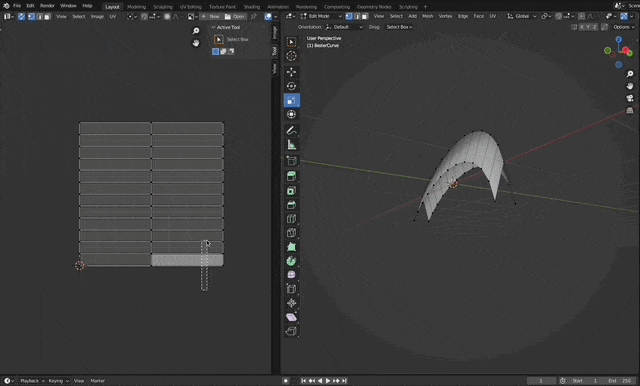
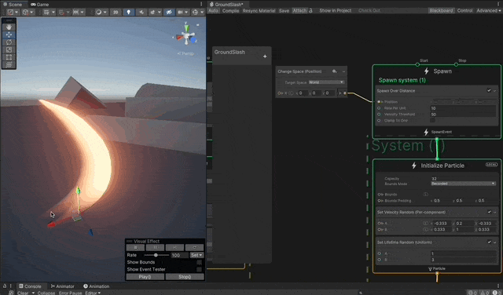
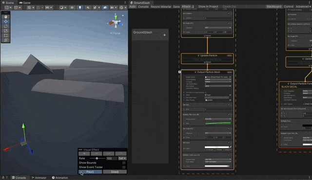
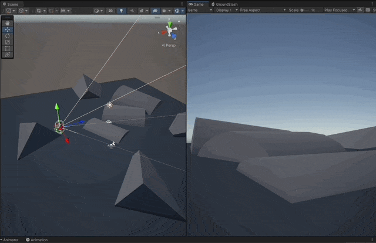

# Ground Slash VFX
A ground slash attack vfx implemented with a Mesh, decal textures, VFX Graph, Shader Graph and some programming. Made in Unity **Unity 2021.3.10f1**

## Features

- [3D Mesh for the Slash](#mesh-for-the-slash)
- [Ground Decals](#ground-decals)
- [First Person Character Controller](#first-person-character-controller)
- [Adjust dynamically to terrain](#adjust-dynamically-to-terrain)
- [Debris](#debris)

## Screenshots

---

## 3D Mesh for the Slash

### VFX Graph for the Slash

---

## Ground Decals

### Spawn over distance and leave a trail

### Decals

---
## First Person Character Controller

---

## Implementation explained

1. **Project configuration**

   1. Use the Universal Render Pipeline.
   1. Use VFX Graph.

1. **Mesh for the Slash**
   1. Create the Mesh in Blender.
        1. Start with a Bezier curve, extrude it to create a 3D shape
   1. Map the UVs for the gradient texture.
        1. Open the UV editor.
        1. Constrain to Image Bounds.
        1. Map the UVs to be able to use a simple gradient to cover the shape.
   1. Export as _.fbx_ to include the UVs mapping.

1. **VFX Graph for the Slash**
   1. Burst of 1 single particle.
   1. We won't make the particle have a velocity, it will just grow in place.
        > NOTE: We will move the whole VFX object and make it spawn other particles as it moves (decals and debris)
   1. Use an **Output Particle Mesh** node.
        1. Set culling mode to _both_, so it renders all sides of the mesh.
        1. Rotate and adjust until the mesh faces the right direction.
        1. Use the "Soft Particle" setting so that Unity fades the particle when it touches other geometry.
   1. Set lifetime to 2 seconds, also can make this a parameter.
   1. Make the mesh grow over time.
   1. Set a color and intensity.

1. **Gradient Texture**
   1. Use any graphics software to create a gradient texture.
   1. Make a gradient left-to-righ, from zero to full opacity.
   1. In Unity set the "Wrap Mode" to _clamp_, to avoid artifacts in the transparent side.
   1. In the **Output Particle Mesh** node.
        1. Set the gradient texture.

1. **Ground Decals**
   1. Create a secondary system.
   1. In the **Spawn System** node.
        1. Use the **Spawn Over Distance** component, to spawn particles _as_ the VFX itself moves.
        1. Connect a **Change Space** node to it, using "Target Space" _World_.
        1. This means the VFX will detect a change of the position of the VFX, and that will trigger an event to emit particles.
        1. But particles will move along with the whole VFX, so we need to fix that.
   1. In the **Initialize Particle** node.
        1. Change it to _World_ instead of _Local_, so particles stay where they are spawned and don't stick to the VFX.
        1. Set position of particles to (0,0,0) but using _Local_ so it matches the position of the VFX, (otherwise they'd be spawned at the zero position of the world)
   1. Use an **Output Particle Forward Decal** node.
        1. Use a default particle texture.
        1. Rotate, set color, accordingly.
        1. Create two output decals, one black and another orange, to simulate burn.

1. **Programming**
    1. **First Person Character Controller**
          1. Integrate the [starter asset](https://assetstore.unity.com/packages/essentials/starter-assets-first-person-character-controller-196525) in your project.
          1. Add a character controller in the scene.
    1. **Shooter**
        1. Create a component that insantiates a GameObject for the VFX.
        1. Orients the projectile.
        1. Sets a velocity to the rigid body.
    1. **Projectile**
        1. Decreases its speed over time, to eventually stop.
        1. Casts a Ray into the ground to snap itself to the geometry.

1. **Debris**
    1. Model the meshes of the debris in Blender.
    1. **VFX Graph for the Debris**
        1. Reuse the same system used for the decals, maybe make the decals a sub graph.
        1. Use an **Output Particle Mesh** node.
            1. Set random colors between a range.
            1. Set random size and rotations.
            1. Set size over life for the debris to shrink and dissapear.
        1. In the **Initialize Particle** node.
            1. Set random local velocity to make the particles go in every direction.
        1. In the **Update Particle** node.
            1. Add gravity to the particles.
            1. Add a colission with plane, to make them stop at the ground.
